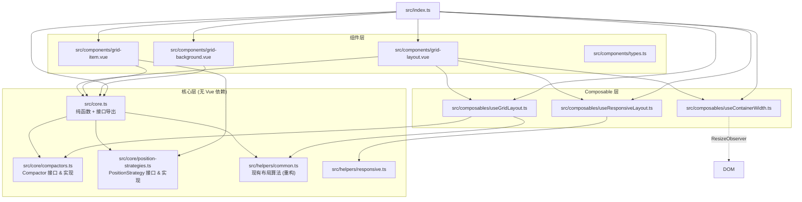

# 设计文档

## 概述

本设计文档描述 grid-layout-plus 补齐 react-grid-layout v2 缺失功能的技术方案。变更覆盖四个层面：

1. **核心算法层**（需求 1-4, 13-15）：水平压缩、可插拔 Compactor/PositionStrategy 接口、允许重叠、核心独立导出、快速压缩器、单元格尺寸计算
2. **组件功能增强**（需求 5-7）：多方向缩放手柄、外部拖入、拖拽阈值
3. **Composable API**（需求 9-11）：useContainerWidth、useGridLayout、useResponsiveLayout
4. **Extras**（需求 8, 12）：Composable Config 分组接口、GridBackground 组件

本次为 Major 版本升级（v2.0.0），允许 breaking changes。废弃的 props 将被移除，新 API 采用更干净的设计。

## 架构

### 模块依赖关系



### 设计原则

- **核心无依赖**：`src/core.ts` 及其子模块不导入 `vue`、不使用 DOM API，可在 Node.js 中直接使用
- **接口优先**：Compactor 和 PositionStrategy 通过 TypeScript 接口定义，内置实现和用户自定义实现地位平等
- **干净 API**：Major 版本升级，移除废弃 props（`verticalCompact`、`useCssTransforms`、`transformScale`），统一使用 `compactor` 和 `positionStrategy` 替代
- **渐进采用**：Composable API 独立于组件，用户可按需使用

## 组件与接口

### 1. Compactor 接口（需求 1, 2, 3, 13）

```typescript
// src/core/compactors.ts

/** 压缩器接口 */
export interface Compactor {
  /** 对布局执行压缩，返回新布局（不修改输入） */
  compact(layout: Layout, cols: number): Layout
  /** 是否允许元素重叠 */
  allowOverlap?: boolean
}

/** 垂直压缩器 — 等价于现有 compact(layout, true) */
export const verticalCompactor: Compactor

/** 水平压缩器 — 按列优先排序后向左压缩 */
export const horizontalCompactor: Compactor

/** 无压缩器 — 返回浅拷贝，不移动元素 */
export const noCompactor: Compactor

/** 快速垂直压缩器 — O(n log n) 实现 */
export const fastVerticalCompactor: Compactor

/** 快速水平压缩器 — O(n log n) 实现 */
export const fastHorizontalCompactor: Compactor

/**
 * 创建带 allowOverlap 选项的压缩器包装
 * 当 allowOverlap=true 时跳过碰撞检测
 */
export function withOverlap(compactor: Compactor): Compactor
```

**水平压缩算法**：
1. 按列优先排序（先 x 后 y）
2. 静态元素加入碰撞列表
3. 对每个非静态元素，保持 y 不变，将 x 向左移动至无碰撞的最小位置
4. 碰撞时放置在障碍物右侧

**快速压缩器算法**：
- 使用区间树（interval tree）加速碰撞检测，将 O(n) 碰撞查询降为 O(log n)
- 整体复杂度从 O(n²) 降为 O(n log n)

### 2. PositionStrategy 接口（需求 14）

```typescript
// src/core/position-strategies.ts

/** 定位策略接口 */
export interface PositionStrategy {
  getStyle(top: number, left: number, width: number, height: number): Record<string, string>
  getRtlStyle(top: number, right: number, width: number, height: number): Record<string, string>
}

/** CSS transform translate3d 定位（默认） */
export const transformStrategy: PositionStrategy

/** CSS top/left/right 绝对定位 */
export const absoluteStrategy: PositionStrategy

/** 缩放定位工厂函数 */
export function scaledStrategy(scale: number): PositionStrategy
```

### 3. calcGridCellDimensions（需求 15）

```typescript
// src/core.ts 导出

export interface GridCellDimensions {
  cellWidth: number
  cellHeight: number
  marginX: number
  marginY: number
}

export function calcGridCellDimensions(params: {
  containerWidth: number
  cols: number
  margin: [number, number]
  rowHeight: number
}): GridCellDimensions
```

### 4. GridLayout 组件增强（需求 2, 5, 6, 7, 8, 14）

```typescript
// src/components/types.ts — v2 props（移除 verticalCompact、useCssTransforms、transformScale）

export interface GridLayoutProps {
  autoSize?: boolean
  colNum?: number
  rowHeight?: number
  maxRows?: number
  margin?: number[]
  isDraggable?: boolean
  isResizable?: boolean
  isMirrored?: boolean
  isBounded?: boolean
  restoreOnDrag?: boolean
  layout: Layout
  responsive?: boolean
  responsiveLayouts?: Partial<ResponsiveLayout>
  breakpoints?: Breakpoints
  cols?: Breakpoints
  preventCollision?: boolean
  useStyleCursor?: boolean

  /** 可插拔压缩器（默认 verticalCompactor） */
  compactor?: Compactor
  /** 可插拔定位策略（默认 transformStrategy） */
  positionStrategy?: PositionStrategy
  /** 所有子项的默认缩放手柄方向 */
  resizeHandles?: ResizeHandle[]
  /** 是否允许外部拖入 */
  isDroppable?: boolean
  /** 外部拖入元素的默认尺寸 */
  dropItem?: { w: number, h: number }
  /** 拖拽阈值（像素） */
  dragThreshold?: number

  /** 分组配置对象（需求 8） */
  gridConfig?: GridConfig
  dragConfig?: DragConfig
  resizeConfig?: ResizeConfig
  dropConfig?: DropConfig
}

export type ResizeHandle = 's' | 'w' | 'e' | 'n' | 'sw' | 'nw' | 'se' | 'ne'

export interface GridConfig {
  colNum?: number
  rowHeight?: number
  maxRows?: number
  margin?: number[]
  autoSize?: boolean
}

export interface DragConfig {
  isDraggable?: boolean
  dragThreshold?: number
  restoreOnDrag?: boolean
}

export interface ResizeConfig {
  isResizable?: boolean
  resizeHandles?: ResizeHandle[]
}

export interface DropConfig {
  isDroppable?: boolean
  dropItem?: { w: number, h: number }
}
```

**新增事件**（需求 6）：
- `drop-drag-over: (gridCoords: { x: number, y: number }, event: DragEvent) => void`
- `drop: (gridCoords: { x: number, y: number, w: number, h: number }, event: DragEvent) => void`
- `drop-drag-leave: (event: DragEvent) => void`

### 5. GridItem 组件增强（需求 5, 7）

```typescript
// src/components/types.ts — GridItemProps 新增

export interface GridItemProps {
  // ... 现有 props 保持不变 ...

  /** 缩放手柄方向（覆盖 GridLayout 的默认值） */
  resizeHandles?: ResizeHandle[]
  /** 拖拽阈值（覆盖 GridLayout 的默认值） */
  dragThreshold?: number
}
```

### 6. GridBackground 组件（需求 12）

```typescript
// src/components/grid-background.vue

export interface GridBackgroundProps {
  cols: number
  rowHeight: number
  margin: [number, number]
  width: number
  rows?: number
  color?: string        // 默认 'rgba(0,0,0,0.1)'
  strokeWidth?: number  // 默认 1
}
```

使用 SVG `<pattern>` 元素渲染网格线，通过 inject 从父 GridLayout 获取配置或通过 props 独立使用。

### 7. Composable API（需求 9, 10, 11）

```typescript
// src/composables/useContainerWidth.ts
export function useContainerWidth(
  el: Ref<HTMLElement | null>
): { width: Ref<number> }

// src/composables/useGridLayout.ts
export interface UseGridLayoutOptions {
  layout: Ref<Layout> | Layout
  cols?: number
  rowHeight?: number
  compactor?: Compactor
  preventCollision?: boolean
}

export interface UseGridLayoutReturn {
  currentLayout: Ref<Layout>
  moveItem: (i: number | string, x: number, y: number) => void
  resizeItem: (i: number | string, w: number, h: number) => void
  addItem: (item: LayoutItem) => void
  removeItem: (i: number | string) => void
}

export function useGridLayout(options: UseGridLayoutOptions): UseGridLayoutReturn

// src/composables/useResponsiveLayout.ts
export interface UseResponsiveLayoutOptions {
  breakpoints: Breakpoints
  cols: Breakpoints
  width: Ref<number>
  layouts: Ref<Partial<ResponsiveLayout>>
  compactor?: Compactor
  originalLayout: Ref<Layout>
}

export interface UseResponsiveLayoutReturn {
  currentBreakpoint: Ref<Breakpoint>
  currentCols: Ref<number>
  currentLayout: Ref<Layout>
}

export function useResponsiveLayout(options: UseResponsiveLayoutOptions): UseResponsiveLayoutReturn
```

### 8. 核心独立导出（需求 4）

```typescript
// src/core.ts — 聚合导出

// 从 helpers/common.ts 重新导出纯函数
export {
  compact, moveElement, correctBounds, getAllCollisions,
  getFirstCollision, collides, validateLayout, bottom,
  cloneLayout, sortLayoutItemsByRowCol
} from './helpers/common'

// 导出 Compactor 相关
export {
  type Compactor, verticalCompactor, horizontalCompactor,
  noCompactor, fastVerticalCompactor, fastHorizontalCompactor,
  withOverlap
} from './core/compactors'

// 导出 PositionStrategy 相关
export {
  type PositionStrategy, transformStrategy, absoluteStrategy,
  scaledStrategy
} from './core/position-strategies'

// 导出工具函数
export { calcGridCellDimensions, type GridCellDimensions } from './core/utils'

// 导出类型
export type { Layout, LayoutItem, Breakpoint, Breakpoints, ResponsiveLayout } from './helpers/types'
```

构建配置需在 `vite.config.ts` 的 `rollupOptions.input` 中添加 `src/core.ts` 入口，并在 `package.json` 的 `exports` 中添加 `./core` 路径映射。

## 数据模型

### 类型变更汇总

```typescript
// src/helpers/types.ts — 新增/修改类型

export type ResizeHandle = 's' | 'w' | 'e' | 'n' | 'sw' | 'nw' | 'se' | 'ne'

export interface LayoutItem extends LayoutItemRequired {
  // ... 现有字段保持不变 ...
  resizeHandles?: ResizeHandle[]  // 新增：单项缩放手柄方向
}

/** Compactor 接口 */
export interface Compactor {
  compact(layout: Layout, cols: number): Layout
  allowOverlap?: boolean
}

/** PositionStrategy 接口 */
export interface PositionStrategy {
  getStyle(top: number, left: number, width: number, height: number): Record<string, string>
  getRtlStyle(top: number, right: number, width: number, height: number): Record<string, string>
}

/** 网格单元格尺寸 */
export interface GridCellDimensions {
  cellWidth: number
  cellHeight: number
  marginX: number
  marginY: number
}

/** @internal — 更新 LayoutInstance 以包含新字段 */
export interface LayoutInstance {
  // ... 现有字段保持不变 ...
  compactor: Compactor
  positionStrategy: PositionStrategy
  resizeHandles: ResizeHandle[]
  isDroppable: boolean
  dropItem: { w: number, h: number }
  dragThreshold: number
}
```

### Breaking Changes（v1 → v2 迁移）

| 移除的 prop | 替代方案 | 说明 |
|---|---|---|
| `verticalCompact` | `compactor` | `verticalCompact: true` → `compactor={verticalCompactor}`（默认值），`false` → `compactor={noCompactor}` |
| `useCssTransforms` | `positionStrategy` | `useCssTransforms: true` → `positionStrategy={transformStrategy}`（默认值），`false` → `positionStrategy={absoluteStrategy}` |
| `transformScale` | `positionStrategy` | `transformScale: 0.5` → `positionStrategy={scaledStrategy(0.5)}` |
| 扁平 props（可选保留） | 分组 config | 扁平 props 和分组 config 均可使用，扁平 props 优先级更高 |
| 单个 `resizer` span | `resizeHandles` | 默认 `['se']`，渲染单个手柄，与现有行为一致 |

### 文件变更清单

| 文件 | 操作 | 说明 |
|---|---|---|
| `src/core/compactors.ts` | 新增 | Compactor 接口 + 5 个内置实现 + withOverlap |
| `src/core/position-strategies.ts` | 新增 | PositionStrategy 接口 + 3 个内置实现 |
| `src/core/utils.ts` | 新增 | calcGridCellDimensions |
| `src/core.ts` | 新增 | 核心聚合导出入口 |
| `src/composables/useContainerWidth.ts` | 新增 | 容器宽度 composable |
| `src/composables/useGridLayout.ts` | 新增 | 布局状态管理 composable |
| `src/composables/useResponsiveLayout.ts` | 新增 | 响应式断点 composable |
| `src/components/grid-background.vue` | 新增 | SVG 网格背景组件 |
| `src/helpers/types.ts` | 修改 | 新增 ResizeHandle、Compactor、PositionStrategy 等类型 |
| `src/helpers/common.ts` | 修改 | 重构 compact() 以委托给 Compactor；提取 setTransform 等到 PositionStrategy |
| `src/components/types.ts` | 修改 | GridLayoutProps/GridItemProps 新增 props |
| `src/components/grid-layout.vue` | 修改 | 集成 Compactor、PositionStrategy、外部拖入、拖拽阈值、Config 分组 |
| `src/components/grid-item.vue` | 修改 | 多方向缩放手柄、PositionStrategy 集成、拖拽阈值 |
| `src/index.ts` | 修改 | 重新导出 core、composables、GridBackground |
| `src/style.scss` | 修改 | 8 方向缩放手柄样式 + GridBackground 样式 |
| `vite.config.ts` | 修改 | 添加 core.ts 入口 |
| `package.json` | 修改 | exports 添加 ./core 路径 |
| `tests/compactors.spec.ts` | 新增 | Compactor 单元测试 + 属性测试 |
| `tests/position-strategies.spec.ts` | 新增 | PositionStrategy 测试 |
| `tests/core-utils.spec.ts` | 新增 | calcGridCellDimensions 测试 |
| `tests/composables.spec.ts` | 新增 | Composable 测试 |
| `tests/grid-background.spec.tsx` | 新增 | GridBackground 组件测试 |


## 正确性属性

*属性（Property）是一种在系统所有有效执行中都应成立的特征或行为——本质上是对系统应做什么的形式化陈述。属性是人类可读规格与机器可验证正确性保证之间的桥梁。*

### Property 1: 水平压缩不变量

*对于任意* 有效的 Layout 和列数 cols，执行水平压缩后：
- 每个非静态元素的 x 坐标应为无碰撞的最小值（不能再向左移动）
- 每个元素的 y 坐标应与压缩前相同
- 静态元素的 x、y 坐标应与压缩前相同
- 压缩后的布局中不存在任何两个元素的矩形区域重叠

**Validates: Requirements 1.1, 1.2, 1.3, 1.4**

### Property 2: verticalCompactor 等价性

*对于任意* 有效的 Layout 和列数 cols，`verticalCompactor.compact(layout, cols)` 的输出应与现有 `compact(layout, true)` 函数的输出完全一致（元素顺序和所有字段值相同）。

**Validates: Requirements 2.2**

### Property 3: noCompactor 恒等性

*对于任意* 有效的 Layout 和列数 cols，`noCompactor.compact(layout, cols)` 返回的布局中每个元素的 `{ x, y, w, h }` 应与输入完全相同，且返回的数组引用不同于输入数组。

**Validates: Requirements 2.4**

### Property 4: allowOverlap 跳过碰撞

*对于任意* 有效的 Layout 和任意 Compactor，当 `allowOverlap` 设置为 `true` 时，`withOverlap(compactor).compact(layout, cols)` 返回的布局中每个元素的 `{ x, y }` 应与输入相同（不执行碰撞推移）。

**Validates: Requirements 3.1**

### Property 5: 容器高度计算

*对于任意* 有效的 Layout（包括允许重叠的布局），`bottom(layout)` 的返回值应等于所有元素中 `max(y + h)` 的值（空布局返回 0）。

**Validates: Requirements 3.3**

### Property 6: 缩放手柄渲染数量与方向

*对于任意* ResizeHandle 数组子集（从 `['s','w','e','n','sw','nw','se','ne']` 中选取），当 GridItem 的 `resizeHandles` 设置为该子集时，渲染的手柄 DOM 元素数量应等于数组长度，且每个手柄元素具有对应方向的 CSS 类名。

**Validates: Requirements 5.2, 5.5**

### Property 7: 拖拽阈值行为

*对于任意* 正数阈值 `t` 和任意移动距离 `d`，当 `dragThreshold = t` 时：若 `d < t` 则不触发 dragstart 事件；若 `d >= t` 则触发 dragstart 事件。

**Validates: Requirements 7.2, 7.3**

### Property 8: 扁平 props 优先级

*对于任意* GridLayout 配置项（如 `colNum`、`isDraggable` 等），当同一配置项同时通过扁平 prop 和分组 config 对象传入不同值时，GridLayout 实际使用的值应等于扁平 prop 的值。

**Validates: Requirements 8.5**

### Property 9: useGridLayout 压缩结果一致性

*对于任意* 有效的 Layout、列数和 Compactor，`useGridLayout` 返回的 `currentLayout` 应等于 `compactor.compact(layout, cols)` 的结果。

**Validates: Requirements 10.2**

### Property 10: useGridLayout 操作后重新压缩

*对于任意* 有效的 Layout 和合法的 moveItem/resizeItem 操作，操作执行后 `currentLayout` 应等于对操作后的原始布局重新执行压缩的结果。

**Validates: Requirements 10.3, 10.4**

### Property 11: useGridLayout 增删元素

*对于任意* 有效的 Layout 和新 LayoutItem，`addItem` 后 `currentLayout` 的长度应比操作前多 1 且包含新元素；`removeItem` 后长度应比操作前少 1 且不包含被删元素。

**Validates: Requirements 10.5**

### Property 12: 断点映射正确性

*对于任意* 有效的 breakpoints 配置、cols 配置和容器宽度 width，`useResponsiveLayout` 返回的 `currentBreakpoint` 应等于 `getBreakpointFromWidth(breakpoints, width)` 的结果，`currentCols` 应等于 `getColsFromBreakpoint(currentBreakpoint, cols)` 的结果。

**Validates: Requirements 11.2, 11.3**

### Property 13: 断点切换布局生成

*对于任意* 有效的 breakpoints、cols 和 width 变化序列，当 width 变化导致断点切换时，`useResponsiveLayout` 返回的 `currentLayout` 应等于 `findOrGenerateResponsiveLayout` 对新断点生成的布局。

**Validates: Requirements 11.4, 11.5**

### Property 14: 断点切换布局缓存

*对于任意* 断点切换序列，当从断点 A 切换到断点 B 时，切换前断点 A 的布局应被保存到 layouts 缓存中；再次切换回断点 A 时应恢复缓存的布局。

**Validates: Requirements 11.6**

### Property 15: GridBackground 网格线数量

*对于任意* 有效的 cols、rowHeight、margin、width 和 rows 参数，GridBackground 渲染的 SVG pattern 的宽度应等于 `calcGridCellDimensions` 计算的 `cellWidth + marginX`，高度应等于 `cellHeight + marginY`。

**Validates: Requirements 12.1**

### Property 16: fastVerticalCompactor 等价性

*对于任意* 有效的 Layout 和列数 cols，`fastVerticalCompactor.compact(layout, cols)` 的输出应与 `verticalCompactor.compact(layout, cols)` 的输出完全一致。

**Validates: Requirements 13.3**

### Property 17: fastHorizontalCompactor 等价性

*对于任意* 有效的 Layout 和列数 cols，`fastHorizontalCompactor.compact(layout, cols)` 的输出应与 `horizontalCompactor.compact(layout, cols)` 的输出完全一致。

**Validates: Requirements 13.4**

### Property 18: 内置 PositionStrategy 等价性

*对于任意* top、left/right、width、height 数值，`transformStrategy.getStyle(top, left, width, height)` 的输出应与现有 `setTransform(top, left, width, height)` 一致；`absoluteStrategy.getStyle` 应与 `setTopLeft` 一致；对应的 RTL 方法同理。

**Validates: Requirements 14.2, 14.3**

### Property 19: scaledStrategy 缩放正确性

*对于任意* 正数 scale 和任意 top、left、width、height，`scaledStrategy(scale).getStyle(top, left, width, height)` 生成的 transform 中的坐标值应等于 `top * scale` 和 `left * scale`，尺寸值应等于 `width * scale` 和 `height * scale`。

**Validates: Requirements 14.4**

### Property 20: calcGridCellDimensions 计算正确性

*对于任意* 有效的 containerWidth、cols、margin 和 rowHeight（其中 containerWidth 足够容纳至少一列加两侧 margin），`calcGridCellDimensions` 返回的 `cellWidth` 应等于 `(containerWidth - margin[0] * (cols + 1)) / cols`，`cellHeight` 应等于 `rowHeight`，`marginX` 应等于 `margin[0]`，`marginY` 应等于 `margin[1]`，且 `cellWidth` 为正数。

**Validates: Requirements 15.3, 15.4, 15.6**

## 错误处理

### 输入验证

| 场景 | 处理方式 |
|---|---|
| `compactor` 属性不符合 Compactor 接口 | TypeScript 编译期报错；运行时不做额外检查（信任类型系统） |
| `resizeHandles` 包含无效方向字符串 | TypeScript 编译期报错；运行时忽略无效值 |
| `calcGridCellDimensions` 的 cols ≤ 0 | 返回 `cellWidth: 0`，不抛异常 |
| `calcGridCellDimensions` 的 containerWidth 不足 | 返回计算值（可能为负数），由调用方判断 |
| `useContainerWidth` 传入 null 元素 | 返回 `width: -1`，不抛异常 |
| `useGridLayout.moveItem` 的 id 不存在 | 静默忽略，不修改布局 |
| `useGridLayout.removeItem` 的 id 不存在 | 静默忽略，不修改布局 |
| `validateLayout` 检测到无效布局 | 抛出 Error（保持现有行为） |

### 外部拖入错误处理

| 场景 | 处理方式 |
|---|---|
| `isDroppable=false` 时收到 drag 事件 | 忽略，不触发任何自定义事件 |
| `dropItem` 未设置但 `isDroppable=true` | 使用默认尺寸 `{ w: 1, h: 1 }` |
| dragover 事件的坐标超出网格范围 | 将坐标 clamp 到有效范围 `[0, cols-w]` 和 `[0, maxRows-h]` |

### 向后兼容保护

- 本次为 Major 版本升级（v2.0.0），以下 props 被移除：`verticalCompact`、`useCssTransforms`、`transformScale`
- 移除的 props 由 `compactor` 和 `positionStrategy` 替代，默认值保持相同行为（`verticalCompactor` + `transformStrategy`）
- 扁平 props（如 `colNum`、`isDraggable`）继续保留，同时新增分组 config 对象作为替代方案

## 测试策略

### 测试框架

- **单元测试**：Vitest（`vitest run`，非 watch 模式）
- **组件测试**：@vue/test-utils + happy-dom
- **测试环境**：核心算法测试使用 `@vitest-environment node`，组件测试使用 `happy-dom`

### 测试方法

使用固定示例和边界条件的单元测试验证正确性属性：

- 具体示例和边界条件（空布局、单元素布局、全静态元素等）
- 多组固定布局验证压缩器等价性（fast vs standard）
- 组件集成点（GridLayout 传递 compactor/positionStrategy 到子项）
- 错误条件（无效输入、id 不存在）
- 外部拖入的 DOM 事件模拟

### 测试文件规划

| 文件 | 内容 |
|---|---|
| `tests/compactors.spec.ts` | Compactor 接口实现测试（垂直/水平/无压缩/重叠/快速） |
| `tests/position-strategies.spec.ts` | PositionStrategy 接口实现测试 |
| `tests/core-utils.spec.ts` | calcGridCellDimensions 和 bottom 测试 |
| `tests/composables.spec.ts` | useGridLayout / useResponsiveLayout 测试 |
| `tests/grid-item-handles.spec.tsx` | 多方向缩放手柄渲染测试 |
| `tests/drag-threshold.spec.tsx` | 拖拽阈值行为测试 |
| `tests/config-merge.spec.tsx` | Config 分组合并优先级测试 |
| `tests/grid-background.spec.tsx` | GridBackground 组件渲染测试 |
| `tests/drop-zone.spec.tsx` | 外部拖入集成测试 |
