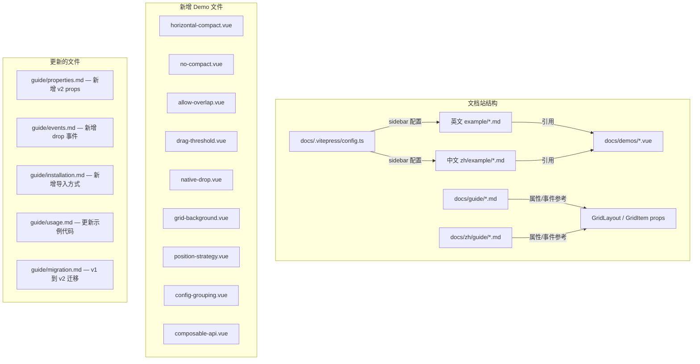
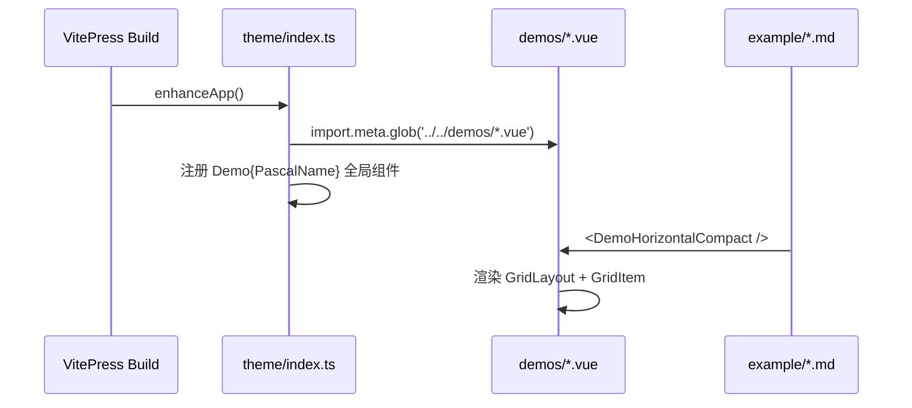

# Design Document: v2-docs-update

## Overview

grid-layout-plus v2.0.0 引入了多项新功能，需要全面更新文档站（VitePress）和 demo 来展示这些功能。本设计覆盖：新增 9 个 demo Vue 组件、双语示例与迁移文档、更新 VitePress 侧边栏配置、更新属性和事件参考文档，以及更新安装/用法指南以反映 v2 的 API 变化。

文档站使用 VitePress，demo 组件在 `docs/demos/` 下以独立 Vue SFC 形式存在，通过 `docs/.vitepress/theme/index.ts` 中的 glob 导入自动注册为 `Demo{PascalName}` 全局组件。`GridLayout` 和 `GridItem` 已全局注册，但 `GridBackground` 需要在 demo 中手动 import。dev-server 通过 `import.meta.glob` 自动路由所有 demo 文件，无需额外配置。

## Architecture



## Sequence Diagrams

### Demo 注册与渲染流程



## Components and Interfaces

### 新增 Demo 组件清单

| Demo 文件名 | 展示功能 | 需要额外 import |
|---|---|---|
| `horizontal-compact.vue` | `horizontalCompactor` 水平压缩 | `horizontalCompactor` from `grid-layout-plus` |
| `no-compact.vue` | `noCompactor` 无压缩 + 自由定位 | `noCompactor` from `grid-layout-plus` |
| `allow-overlap.vue` | `withOverlap()` 允许重叠 | `withOverlap`, `verticalCompactor` from `grid-layout-plus` |
| `drag-threshold.vue` | `dragThreshold` 拖拽阈值 | 无 |
| `native-drop.vue` | `isDroppable` + `dropItem` 原生拖放 | 无 |
| `grid-background.vue` | `GridBackground` SVG 网格背景 | `GridBackground` from `grid-layout-plus` |
| `position-strategy.vue` | `positionStrategy` 定位策略切换 | `transformStrategy`, `absoluteStrategy`, `scaledStrategy` from `grid-layout-plus` |
| `config-grouping.vue` | `gridConfig`/`dragConfig`/`resizeConfig`/`dropConfig` | 无 |
| `composable-api.vue` | `useGridLayout` / `useContainerWidth` | `useGridLayout`, `useContainerWidth` from `grid-layout-plus` |

### Demo 组件通用模式

```typescript
// 每个 demo 遵循的 SFC 结构
interface DemoPattern {
  // <script setup lang="ts"> — 导入必要的 API，定义响应式布局数据
  // <template> — 使用全局 GridLayout/GridItem + 交互控件
  // <style scoped> — 使用 .vgl-layout / :deep(.vgl-item) 等标准样式
}
```

## Data Models

### GridLayout v2 新增 Props

```typescript
interface GridLayoutV2Props {
  // 可插拔压缩器（替代 verticalCompact: boolean）
  compactor?: Compactor                    // 默认: verticalCompactor
  // 可插拔定位策略（替代 useCssTransforms + transformScale）
  positionStrategy?: PositionStrategy      // 默认: transformStrategy
  // 外部拖入
  isDroppable?: boolean                    // 默认: false
  dropItem?: { w: number, h: number }      // 默认: { w: 1, h: 1 }
  // 拖拽阈值
  dragThreshold?: number                   // 默认: 0
  // 分组配置
  gridConfig?: GridConfig
  dragConfig?: DragConfig
  resizeConfig?: ResizeConfig
  dropConfig?: DropConfig
}

interface Compactor {
  readonly type?: 'vertical' | 'horizontal'
  compact(layout: Layout, cols: number): Layout
  allowOverlap?: boolean
}

interface PositionStrategy {
  readonly transformScale?: number
  getStyle(top: number, left: number, width: number, height: number): Record<string, string>
  getRtlStyle(top: number, right: number, width: number, height: number): Record<string, string>
}
```

### GridItem v2 新增 Props

```typescript
interface GridItemV2Props {
  dragThreshold?: number   // 覆盖 GridLayout 的默认值
}
```

### 新增事件

```typescript
// GridLayout 新增事件
interface GridLayoutV2Events {
  'drop-drag-over': (position: { x: number, y: number }, event: DragEvent) => void
  'drop': (item: { x: number, y: number, w: number, h: number }, event: DragEvent) => void
  'drop-drag-leave': (event: DragEvent) => void
}
```

### 可用的压缩器

```typescript
// 标准压缩器
export const verticalCompactor: Compactor     // 垂直压缩（默认，等价于 v1 的 verticalCompact: true）
export const horizontalCompactor: Compactor   // 水平压缩（元素向左靠拢）
export const noCompactor: Compactor           // 无压缩（自由定位）

// 快速压缩器（区间树加速，O(n log n)）
export const fastVerticalCompactor: Compactor
export const fastHorizontalCompactor: Compactor

// 包装器
export function withOverlap(compactor: Compactor): Compactor  // 允许元素重叠
```

### 可用的定位策略

```typescript
export const transformStrategy: PositionStrategy   // CSS transform translate3d（默认）
export const absoluteStrategy: PositionStrategy     // CSS top/left 绝对定位
// 适配具有相同 CSS transform: scale(...) 的祖先，样式仍使用布局坐标
export function scaledStrategy(scale: number): PositionStrategy
```

### Composable API

```typescript
// 核心布局状态管理（不依赖 DOM，SSR 安全）
export function useGridLayout(options: UseGridLayoutOptions): UseGridLayoutReturn

// 响应式断点管理（不依赖 DOM，SSR 安全）
export function useResponsiveLayout(options: UseResponsiveLayoutOptions): UseResponsiveLayoutReturn

// 容器宽度监听（依赖 ResizeObserver）
export function useContainerWidth(el: Ref<HTMLElement | null>): { width: Ref<number> }
```


## Key Functions with Formal Specifications

### Demo 文件创建

```typescript
function createDemoFile(name: string, features: Feature[]): VueSFC
```

**Preconditions:**
- `name` 是合法的 kebab-case 文件名
- `features` 中引用的 API 均已在 `src/index.ts` 中导出
- 如果使用 `GridBackground`，必须在 `<script setup>` 中手动 import

**Postconditions:**
- 生成的 SFC 包含 `<script setup lang="ts">`、`<template>`、`<style scoped>`
- 使用全局注册的 `GridLayout` 和 `GridItem`（无需 import）
- 包含交互控件（checkbox/select/button）让用户切换功能
- 样式遵循现有 demo 的 `.vgl-layout` / `:deep(.vgl-item)` 模式

### 文档页面创建

```typescript
function createExamplePage(name: string, lang: 'en' | 'zh'): Markdown
```

**Preconditions:**
- 对应的 demo Vue 文件已存在于 `docs/demos/`
- 组件名遵循 `Demo{PascalCase}` 命名规则

**Postconditions:**
- 英文页面包含 `# Title` / `## Effect` / `<ClientOnly><DemoXxx /></ClientOnly>` / `## Source` / `<<< @/demos/xxx.vue`
- 中文页面包含 `# 标题` / `## 效果` / 同上组件引用 / `## 源码` / 同上源码引用
- 组件名与 `theme/index.ts` 中 glob 自动注册的名称一致

### 侧边栏配置更新

```typescript
function updateSidebarConfig(config: VitePressConfig): VitePressConfig
```

**Preconditions:**
- `docs/.vitepress/config.ts` 中已有 `Example` 和 `示例` 分组

**Postconditions:**
- 英文 sidebar 的 Example 分组中新增全部 9 个新 demo 的链接
- 中文 sidebar 的 示例 分组中新增对应的 9 个中文链接
- 链接顺序：现有 demo 保持不变，新 demo 追加在末尾
- 中文 sidebar 中已有的 `styling-grid-lines` 和 `styling-placeholder` 链接修复为 `/zh/example/` 前缀

## Algorithmic Pseudocode

### Demo 文件结构算法

```pascal
ALGORITHM createDemo(featureName, imports, layoutData, templateContent, controls)
INPUT: featureName, imports[], layoutData[], templateContent, controls[]
OUTPUT: Vue SFC 文件内容

BEGIN
  // Step 1: 生成 script setup
  script ← "<script setup lang=\"ts\">"
  IF imports.length > 0 THEN
    FOR each import IN imports DO
      script ← script + importStatement(import)
    END FOR
  END IF
  script ← script + defineLayoutData(layoutData)
  IF controls.length > 0 THEN
    script ← script + defineControlRefs(controls)
  END IF
  script ← script + "</script>"

  // Step 2: 生成 template
  template ← "<template>"
  IF controls.length > 0 THEN
    template ← template + renderControls(controls)
  END IF
  template ← template + renderGridLayout(templateContent)
  template ← template + "</template>"

  // Step 3: 生成 scoped style（复用标准样式模式）
  style ← standardDemoStyles()

  RETURN script + template + style
END
```

## Example Usage

### 水平压缩 Demo 示例

```vue
<script setup lang="ts">
import { reactive, ref } from 'vue'
import { horizontalCompactor, verticalCompactor } from 'grid-layout-plus'

const compactMode = ref<'vertical' | 'horizontal'>('horizontal')
const compactors = { vertical: verticalCompactor, horizontal: horizontalCompactor }
const layout = reactive([...])
</script>

<template>
  <select v-model="compactMode">
    <option value="vertical">Vertical</option>
    <option value="horizontal">Horizontal</option>
  </select>
  <GridLayout v-model:layout="layout" :compactor="compactors[compactMode]" :row-height="30">
    <template #item="{ item }">
      <span class="text">{{ item.i }}</span>
    </template>
  </GridLayout>
</template>
```

### GridBackground Demo 示例

```vue
<script setup lang="ts">
import { reactive } from 'vue'
import { GridBackground } from 'grid-layout-plus'

const layout = reactive([...])
</script>

<template>
  <GridLayout v-model:layout="layout" :row-height="30">
    <GridBackground />
    <template #item="{ item }">
      <span class="text">{{ item.i }}</span>
    </template>
  </GridLayout>
</template>
```

### 原生拖放 Demo 示例

```vue
<script setup lang="ts">
import { reactive } from 'vue'

const layout = reactive([...])

function handleDrop(item: { x: number, y: number, w: number, h: number }) {
  layout.push({ ...item, i: String(layout.length) })
}
</script>

<template>
  <div draggable="true" class="droppable-element">Drag me into the grid</div>
  <GridLayout
    v-model:layout="layout"
    :row-height="30"
    is-droppable
    :drop-item="{ w: 2, h: 2 }"
    @drop="handleDrop"
  >
    <template #item="{ item }">
      <span class="text">{{ item.i }}</span>
    </template>
  </GridLayout>
</template>
```

## Correctness Properties

*A property is a characteristic or behavior that should hold true across all valid executions of a system-essentially, a formal statement about what the system should do. Properties serve as the bridge between human-readable specifications and machine-verifiable correctness guarantees.*

### Property 1: New props documentation completeness

*For any* new v2 GridLayout prop (`compactor`, `positionStrategy`, `isDroppable`, `dropItem`, `dragThreshold`, `gridConfig`, `dragConfig`, `resizeConfig`, `dropConfig`), the `properties.md` file SHALL contain a dedicated section documenting that prop with its type, default value, and description.

**Validates: Requirement 11.1**

### Property 2: New events documentation completeness

*For any* new v2 GridLayout event (`drop-drag-over`, `drop`, `drop-drag-leave`), the `events.md` file SHALL contain a dedicated section documenting that event with its TypeScript signature.

**Validates: Requirements 12.1, 12.2**

### Property 3: Removed props absent from usage examples

*For any* code example block in `usage.md`, the block SHALL NOT contain the removed prop names `vertical-compact` or `use-css-transforms`, and SHALL use their v2 equivalents instead.

**Validates: Requirement 14.1**

### Property 4: English sidebar completeness

*For any* new demo page, the English sidebar "Example" group in `config.ts` SHALL contain a link entry pointing to the corresponding `/example/{demo-name}` path.

**Validates: Requirement 15.1**

### Property 5: Chinese sidebar completeness

*For any* new demo page, the Chinese sidebar "示例" group in `config.ts` SHALL contain a link entry pointing to the corresponding `/zh/example/{demo-name}` path.

**Validates: Requirement 15.2**

### Property 6: Bilingual example page correspondence

*For any* new English Example_Page at `docs/example/{name}.md`, there SHALL exist a corresponding Chinese Example_Page at `docs/zh/example/{name}.md` that references the same `Demo{PascalName}` component and the same source code path.

**Validates: Requirements 16.1, 16.3**

### Property 7: Bilingual guide page correspondence

*For any* new or updated section in an English Guide_Page, the corresponding Chinese Guide_Page SHALL contain a structurally equivalent section covering the same props, events, or API items.

**Validates: Requirement 16.2**

### Property 8: Demo naming validity and uniqueness

*For any* new Demo_Component file in `docs/demos/`, the filename SHALL be kebab-case ending in `.vue`, and converting it to `Demo{PascalName}` SHALL produce a name that is unique among all registered demo components.

**Validates: Requirements 17.1, 17.3**

## Error Handling

### Demo 运行时错误

**Condition**: 用户在 demo 中切换压缩器/定位策略时可能触发布局重排
**Response**: 使用 `computed` 或 `ref` 确保响应式更新，避免直接替换 prop 引用
**Recovery**: 布局数据使用 `reactive` 或 `ref` 包裹，确保 Vue 响应式系统正确追踪

### GridBackground 未注册错误

**Condition**: 如果 demo 中使用 `<GridBackground>` 但未 import，VitePress 构建会报错
**Response**: 在所有使用 GridBackground 的 demo 中显式 import
**Recovery**: VitePress 构建失败时检查 demo 中的 import 语句

## Testing Strategy

### 手动验证

1. `pnpm dev` — 在 dev-server 中逐个访问新 demo，验证交互功能
2. VitePress 本地预览 — 验证所有新页面渲染正确、源码展示正确
3. 双语切换 — 验证中英文页面内容一致

### 构建验证

1. `pnpm build` — 确保库构建不受文档变更影响
2. VitePress build — 确保文档站构建成功，无未解析的组件引用

## Dependencies

- 无新增依赖。所有新功能的 API 已在 `grid-layout-plus` 包中导出。
- `GridBackground` 组件已在 `src/index.ts` 中导出，VitePress 通过 alias 解析到 `src/`。
- dev-server 通过 `import.meta.glob('../docs/demos/*.vue')` 自动发现新 demo 文件。
